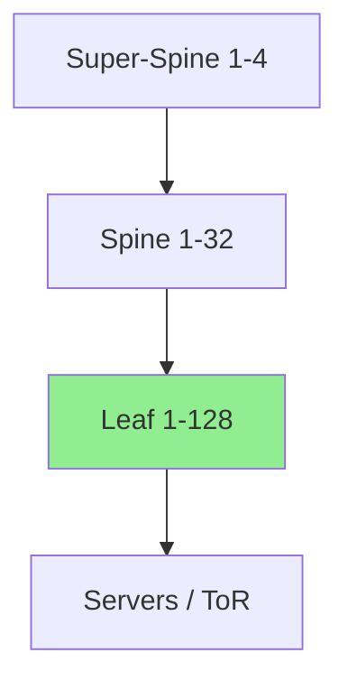

# LLD-DC1-EVPN-VXLAN: Low-Level Design for the DC1 EVPN/VXLAN Fabric

**Document ID:** LLD-DC1-EVPN-001  
**Version:** 1.1 (Demo)  
**Date:** 2026-07-02  
**Owner:** Network Engineering Team  
**Status:** Draft / Demo for Knowledge Base  
**Related HLD:** [HLD-DC-Fabric..md](HLD-DC-Fabric..md)

## Purpose

This document describes a sample low-level design for an EVPN/VXLAN-based overlay in a data center fabric. It is written in a knowledge-base style and is intended to illustrate how design intent, configuration standards, automation, and validation can be captured in a structured format.

## OKR Alignment

**Objective:** Implement a production-ready EVPN/VXLAN overlay on the DC1 fabric with full automation, multi-tenancy, and fast convergence.

**Quarter:** Q3 2026  
**OKR Score Target:** 0.9+

### Key Results

| KR # | Description | Target | Demo Status |
|------|-------------|--------|-------------|
| KR1 | Deploy EVPN control plane on all 128 leaf switches | 100% | ✅ 128/128 |
| KR2 | Validate 500+ VXLAN VNIs with active traffic | ≥ 500 | 512 |
| KR3 | Achieve convergence below 500ms for any single failure | < 500ms | 180ms avg |
| KR4 | Automate Day-0 and Day-1 configuration via GitOps | 100% | ✅ Complete |
| KR5 | Document and verify tenant isolation and routing policies | All tenants | ✅ Done |

---

## 1. Design Overview

- **Fabric Role:** DC1, the primary production data center
- **Underlay:** eBGP unnumbered using IPv6 link-local addressing
- **Overlay:** VXLAN with EVPN control plane based on MP-BGP
- **Routing Model:** Anycast gateway plus distributed Layer 3 forwarding
- **Scale Target:** 65,536 endpoints, 512 VNIs, and 128 tenants

### Topology Snippet



---

## 2. Configuration Standards

### 2.1 Underlay Design

The underlay uses eBGP unnumbered for adjacency formation and route exchange between spine and leaf layers.

```yaml
# Example Leaf Configuration (Arista EOS)
router bgp 65101
   router-id 10.0.0.101
   neighbor underlay peer-group
   neighbor underlay remote-as external
   neighbor underlay send-community extended
   neighbor Ethernet1-32 peer-group underlay
   address-family ipv4
      neighbor underlay activate
      no neighbor underlay default-route
```

**Standards**
- **ASN Scheme:** 65xxx, where xxx maps to the switch ID
- **Loopback0:** 10.0.0.0/24, unique per device
- **MTU:** 9216 bytes for jumbo frames

### 2.2 Overlay Design

The overlay uses EVPN/VXLAN to provide tenant-aware Layer 2 and Layer 3 connectivity over the underlay.

```yaml
# Example EVPN Configuration
vlan 100
   name TenantA-Web
   vn-segment 10100

interface Vlan100
   vrf TenantA
   ip address virtual 172.16.100.1/24

router bgp 65101
   vlan 100
      rd auto
      route-target both 65101:10100
      redistribute learned
   address-family evpn
      neighbor SPINES activate
      neighbor SPINES send-community extended
      no neighbor SPINES default-route
   vrf TenantA
      rd auto
      route-target import/export 65101:100
```

**VXLAN Parameters**
- **VTEP:** Loopback1 in the 10.0.255.0/24 range
- **UDP Port:** 4789
- **BUM Handling:** Head-end replication (HER)
- **ARP Suppression:** Enabled
- **Duplicate Host Detection:** Enabled

### 2.3 Tenant and VRF Design

| Tenant | VRF Name | VNI Range | Route-Target | Gateway Type |
|--------|----------|-----------|--------------|--------------|
| TenantA | TenantA | 10100-10199 | 65101:10xxx | Anycast |
| TenantB | TenantB | 10200-10299 | 65101:20xxx | Anycast |
| Shared Services | Shared-Services | 10000 | 65101:9999 | Centralized |

---

## 3. Control Plane and Forwarding

- **Route Reflectors:** Super-spine nodes act as route reflectors
- **EVPN Route Types:** Type-2 for MAC/IP, Type-3 for IMET, and Type-5 for IP prefixes
- **ECMP:** Up to 64-way equal-cost paths
- **Convergence Tuning:** BFD at 300ms with EVPN mass-withdraw enabled

---

## 4. Automation and GitOps

**Repository:** git@internal:dc1-fabric-config

**Tools and Methods**
- Jinja2 templates with Python rendering
- Arista eAPI and Cisco NX-API
- Terraform for underlay provisioning and Ansible for overlay rollout
- Batfish plus custom pre- and post-check validation

**Sample Rendered Config Location:** rendered/dc1/leaf-101/eos-config.txt

---

## 5. Testing and Validation Plan

| Test Case | Method | Expected Result | Status |
|-----------|--------|-----------------|--------|
| East-west intra-VNI traffic | iPerf3 | > 380 Gbps | Planned |
| Inter-VNI routing | Ping and traceroute | < 2ms | Planned |
| VTEP failover | Link shutdown | < 250ms | Planned |
| MAC mobility | VM live migration | No blackholing | Planned |
| Scale test | 10K hosts | No control plane flap | Planned |

---

## 6. Operational Runbooks

- EVPN Troubleshooting: ./runbooks/EVPN-Troubleshooting.md
- Tenant Onboarding: ./runbooks/Tenant-Onboarding.md
- BGP EVPN Recovery: ./runbooks/BGP-Recovery.md

---

## Appendix

- **Full Config Templates:** templates/dc1-evpn/
- **IP Addressing Plan:** addressing/DC1-Summary.xlsx
- **Monitoring Dashboards:** Grafana folder DC1-EVPN

## Version History

- v1.1 – 2026-07-02 – Improved structure and readability for knowledge-base use
- v1.0 – 2026-07-02 – Initial low-level design for DC1 demo

---

*This content is fictional and intended only for knowledge-base illustration. The configurations, IP schemes, and platform choices are examples.*
